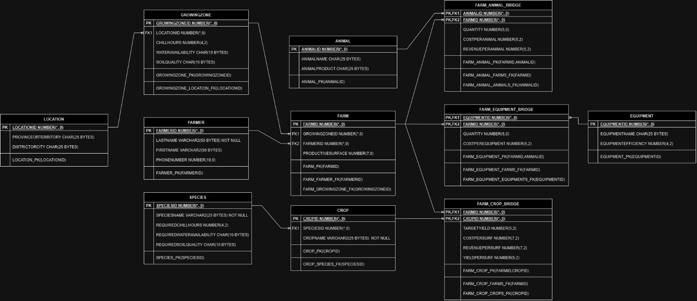

# Farming Database Project

## Overview

This project focuses on developing a comprehensive database solution for medium and small-scale agriculture management. It aims to address the challenges faced by farmers, enabling informed decision-making for improved sustainability and productivity in the agriculture sector.

## Team Members

- Lovejeet Singh
- Harkit Singh Chhabra
- Ashwin B N
- Pablo Ignacio Tapia Figueroa

## Milestones Summary

### Milestone 1 - Project Idea and Proposal

Outlined the need for improved agriculture management, identified challenges, and proposed a database solution to empower farmers and authorities.

### Milestone 2 - Database Design

Developed the initial database schema and relationships, focusing on environmental parameters and farm-specific data.

### Milestone 3 - Database Design Update

Refined the database schema, removed unrelated tables, improved column headings for better data accuracy, and adjusted precision for specific columns.

## Database Structure

The project's database is structured around several key tables:

- Location
- GrowingZone
- Farmer
- Species
- Farm
- Crop
- Farm_Crop_Bridge

The relationships between these tables enable the management of farm-specific data, environmental parameters, and crop information.

### Entity Relationship Diagram (ERD)

### Oracle Code

Included SQL code for creating tables, inserting sample data, and views for generating business reports based on the database information.

## Usage

To utilize this project:

1. **Database Setup**: Execute the provided SQL scripts to create the tables and insert sample data.
2. **View Creation**: Use the provided Oracle code to generate views for generating business reports.
3. **Integration**: Integrate real-time weather data sources for enhanced functionality (not included in this project).

## Conclusion

This project aims to provide a robust database solution for agriculture management. It's a foundation that can be further enhanced by integrating real-time data sources and expanding functionalities to cater to specific regional needs.
